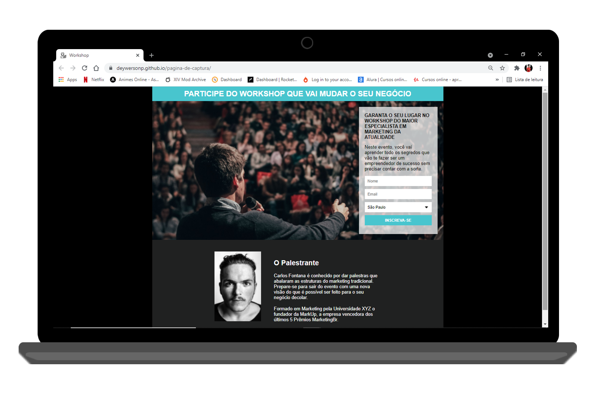
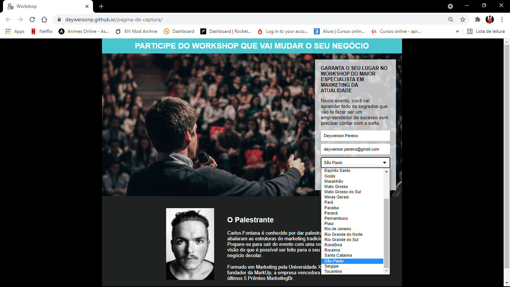
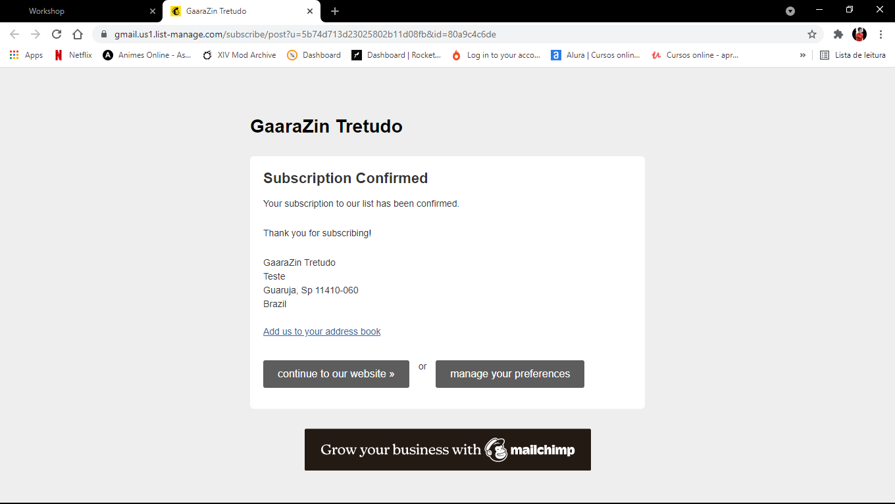

<h1 align="center">
 Página de Captura
</h1>

  <a href="#-project">Project</a>&nbsp;&nbsp;&nbsp;|&nbsp;&nbsp;&nbsp;
  <a href="#-technologies">Technologies</a>&nbsp;&nbsp;&nbsp;|&nbsp;&nbsp;&nbsp;
  <a href="#-services-used">Services Used</a>&nbsp;&nbsp;&nbsp;|&nbsp;&nbsp;&nbsp;
  <a href="#-getting-started">Getting Started</a>&nbsp;&nbsp;&nbsp;|&nbsp;&nbsp;&nbsp;
  <a href="#-how-to-use">How To Use</a>&nbsp;&nbsp;&nbsp;|&nbsp;&nbsp;&nbsp;
  <a href="#-features">Features</a>&nbsp;&nbsp;&nbsp;

 

 

  

## 💻 Project

TODO List is a project developed to pratice knowledg adquired in JavaScript Intermediary. It's a project based on create online tasks list.

On the last class lessons, we learned how to use localStorage to save information, and we were challenged to make a ToDo List with this configuration.

Challenged by Desenvolvimento WEB - Do Zero ao Primeiro projeto (Programador BR) - JavaScript Intermediary 16ª lesson. 

 

This application is hosted on GitHub Pages, [click here to see it](https://deywersonp.github.io/pagina-de-captura/).

  

## 🚀 Technologies

This project was developed using these techs:

- [HTML](https://developer.mozilla.org/pt-BR/docs/Web/HTML)
- [CSS](https://developer.mozilla.org/pt-BR/docs/Web/CSS)

 

## 👨‍🔧 Services Used

- [Mailchimp](https://mailchimp.com/)
- GitHub
- [GitHub Pages](https://pages.github.com/)

 

## 🎮 Getting Started

If you want run this code, you can start cloning the repository using HTTP or SSH key.

- Open your git
- Type `git clone`
- Insert the HTTP or SSH key (on windows, shift + insert to paste on gitBash)
- You can find this HTTP or SSH Key by clicking on `Code` on the top right in this repository

- Once cloned you can open the project in your IDE and open the archive `index.html` on your browser.

  

## 📌 How to Use

### 1 - When you access the project, you will see the home page

### 2 - On this page you can enter customer's information, like name, email and city

### 3 - When you click send, a new page will open informing you of the successful registration in the contact list

 
 

## 🕵 Features

The main features of the application are:

 - Get customer information
 - Registering in a database for sending email
 
 

 > In case of sensitive bugs like security vulnerabilities, please contact
 > <a href = "mailto:deywerson.pereira@gmail.com">deywerson.pereira@gmail.com</a> directly instead of using issue tracker. We value your effort
 > to improve the security and privacy of this project!
  
 
---
  

      
Please follow on github and join us! Thanks for visiting me and good coding!

Made with ♥ by <a href="https://github.com/deywersonp">Deywerson Pereira</a>
